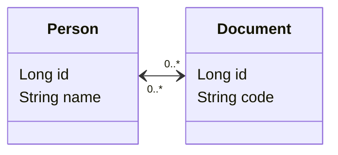
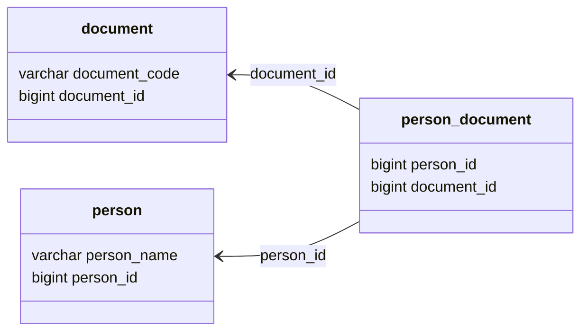

# POC: JPA Many-to-Many

It demonstrates how to use JPA to implement many-to-many relationship.

The goal is to be able to persist information about people, documents and links between them. Every person must have one
or none document registered, and we want to make the references consistent.

In this example both `Person` and `Document` entities have references to each other, and we are responsible to manage
the
consistency. The `Person` entity was chosen to be the owner of the relationship, so it contains both `ManyToMany`
and `JoinTable` annotations describing how the ORM should create the join table to manage foreign keys. The `Document`
entity is also annotated with `ManyToMany` but it only describes what field of the relationship owner manages its
reference.

## How to run

| Description | Command          |
|:------------|:-----------------|
| Run tests   | `./gradlew test` |

## Preview

Entity Relationship Model:

Database schema:

